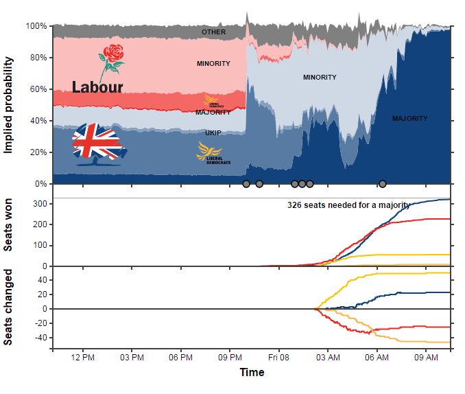

# TorQonnect-Betfair
This is a market data capture system for sports exchange (betting) data from betfair.com.  This is based on kdb+ and [AquaQ's TorQ](https://github.com/AquaQAnalytics/TorQ) framework.

I've used this system already to capture a range of cool data on events including [Superbowl XLIX](http://www.picodoc.org/superbowl-xlix-data-visualization/), the [2015 Six Nations championship](http://www.picodoc.org/six-nations-2015/) and the [2015 UK general election](http://www.picodoc.org/uk-general-election-2015-telling-the-story-of-results-night-with-data/) (shown above). 

## Prerequisites

To get this framework up and running in a unix environment you need two things:

1. A Windows or Unix environment with python installed.
2. The [free 32 bit version of kdb+](http://kx.com/software-download.php) set up and available from the command prompt as q.
3. openssl installed (should be present in Unix systems by default).  You can download a Windows installer [here](http://gnuwin32.sourceforge.net/packages/openssl.htm).  It is recommended that you add the loocation of the openssl executable to the PATH environment variable.
4. Python is required (should work fine with v2 or v3).  The requests module is also required, more info on it [here](http://docs.python-requests.org/en/latest/user/install/)
5. A betfair.com account. If you don't already have an account you can get one [here](https://register.betfair.com/account/registration).


## Set Up

* Download a zip of the latest version of [TorQ](https://github.com/AquaQAnalytics/TorQ/archive/master.zip)
* Download a zip of [this starter pack](https://github.com/AquaQAnalytics/TorQonnect-Betfair/archive/master.zip)
* Unzip TorQ
* Unzip the starter pack over the top (this will replace some files)
* Add some account details to *config/settings/requestor.q*
    - fill in betfair.com username and password

        ```
        .requestor.username:"me";
        .requestor.password:"password";
        ```

    - Betfair also requires something called an **Application Key**.  You can find more information on this and how to obtain it [here](https://api.developer.betfair.com/services/webapps/docs/display/1smk3cen4v3lu3yomq5qye0ni/Application+Keys).  If you follow the instructions listed under **How to Create An Application Key** betfair will give you one.  Make sure you are logged into your betfair account while you follow the instructions and the **sessionToken** will be automatically filled in, making you life alot easier.  For the **Application name** you can choose anything you like.
    - Once you've followed the steps to create an application key, in the API-NG visualizer click **getDeveloperAppKeys** then **Execute**.  This will return two keys, one with a delay and one without.  You probably want the one without.  Add this info to *requestor.q*.

        ```
        .requestor.appKey:"eQud5Jawxlq2CuLQ";
        ```

* Since this framework will collect data automatically it requires a non-interactive authorised login method.  Details of how to set this up with Betfair are [here](http://docs.developer.betfair.com/docs/display/1smk3cen4v3lu3yomq5qye0ni/Non-Interactive+(bot)+login).  Follow the instructions in the sections **Creating a Self Signed Certificate** and **Linking the Certificate to Your Betfair Account**.  This will generate 3 files:
    - client-2048.key
    - client-2048.csr
    - client-2048.crt
    - Copy all 3 of these files into the *config/certificates* folder.
* Finally we need to add some events to collect data on!  This configuration is held in the *config/requestor.csv* file. There are five columns in this config file:
 - **marketId**  The unique identifier for the market. MarketId's are prefixed with '1.' or '2.'
 - **market** Free text field used to identify the market in the config
 - **start** Timestamp to indicate when to start polling for data 
 - **end** Timestamp to indicate when to stop polling for data 
 - **interval** Period of time between polls

* This file will be loaded when the requestor process starts. Additional markets can be added to config when the process is live using the *.requestor.addSubscription* function.

    ```
    .requestor.addSubscription["Grexit";`1.117087478;0Wp;0D00:00:10]
    ```
    
* The best way to find the marketId for a particular event is using the betfair [Betting API visualiser](https://developer.betfair.com/exchange-api/betting-api-demo/).  Under **listMarketCatalogue** you can search through the available markets by name, volume traded, sport etc.  Again if you're logged in before you click this the **Session Token** will autofill, and the **appKey** is the same as the one you filled in above.
* Once you have a few markets setup to collect data on, all that's left to do is run the startup script to start up the TorQ stack and start collecting data!

    ```
    sh start_torq_betfair.sh
    ```
or double-click on the *start_torq_betfair.bat* file if you are running on Windows.

## Using the API

* Once you have some data in the system there are some basic queries that can be run on the gateway to retrieve data.  
    - You can run to get a list of available markets for a given date: 

        ```
        getActiveMarkets[date]

	eg.
	getActiveMarkets[2000.01.01]
	getActiveMarkets[.z.d]
        ```
    - To return information about the mid price run (pivot will return the different outcomes as columns instead of rows):
        
        ```
	getMid[marketID;pivot]

	eg.
        getMid[`1.117087478;0b]
	getMid[`1.117087478;1b]
        ```
    - To return the implied odds based on trades matched, and the volume of trades matched, run (bucket is in minutes):

        ```
        getOdds[marketID;bucket;pivot]

	eg.
	getOdds[`1.117087478;10;1b]
	getOdds[`1.117087478;1;0b]
        ```
    - To return the volume weighted average price you would have to pay if trading a given volume run:

	```
        getVwap[marketID;size]

        eg.
        getVwap[`1.117087478;1]
        getVwap[`1.117087478;1000]
        ```

